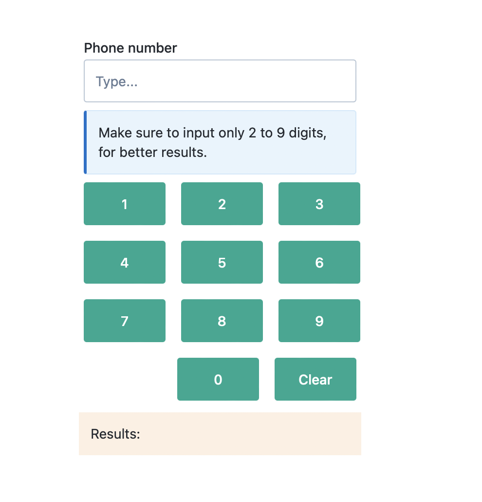
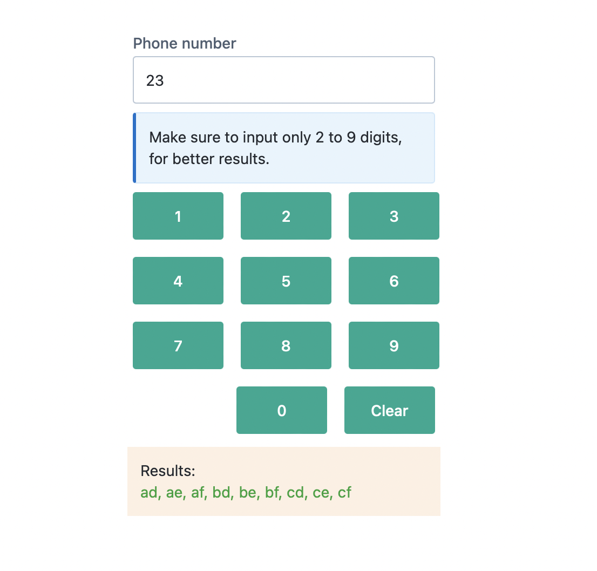
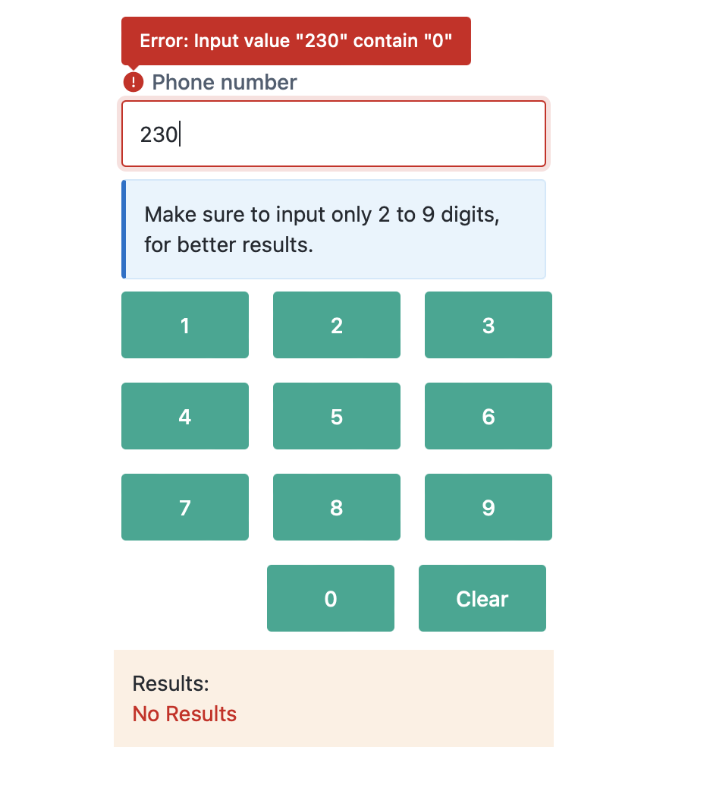

# Words Generator From Phonewords



### Intro

This application provide Node backend and React frontend to generate Phonewords, That converts a given numeric string
into a list of corresponding words in the style of T9 or Phonewords.





### Description

Application converts a given numeric string into a list of corresponding words in the style of [T9](<https://en.wikipedia.org/wiki/T9_(predictive_text)>) or [Phonewords](https://en.wikipedia.org/wiki/Phoneword).

For example, given the input “23” the output will display as results in frontend as: ad, ae, af, bd, be, bf, cd, ce, cf.

Both frontend and backend application validate the user inputs, Given entry should be numaric and the numaric entry should not contain 0, 1 or any spaces. And system respond for Maximum length of 9 as default configuration for user inputs.

Frontend is developed using React (Typescript application) and the Backend is developed using (Typescript application with Nodejs)

The Rest Api is developed using Express

Whole solution is configured with docker/docker-compose setup to run it all. Go to `localhost:3001` for access fronend, And to access backend use `localhost:3000`.

### Get Started

#### To run simple run of the application

```
docker-compose up
```

or

```
docker-compose up -d
```

#### Use below command for to stop the docker-compose

```
docker-compose down
```


**Let's build, test and deploy system as each**


## Frontend

#### Third party libraries

- ReactJS (18.1.0)
- NextJS (12.1.6)
- Kiwi.com Orbit Components (2.22.2)
- Typescript (4.7.3)
- Jest and React Testing Library (13.3.0)

Frist of all you have to install packages 
```
npm install 
```
For run the application in develop mode
```
npm run dev
```

`npm run start` Runs the built app in production mode.

Server on `0.0.0.0:3000`, url: `http://localhost:3000`

using `npm run build` you can build the frontend project, but run the 
```
npm run export
```
for build and export the build file to `out` directory

Use the for see all the tests
```
npm run test
```
#### For build and run via docker image

Build the image
```
docker build . -t fronend
```
To run and forward the port
```
docker run -d -p 3000:80 fronend
```
For stop the docker container  `docker stop <CONTAINER ID>`, Try `docker ps` to find your container id

---- 
## Backend

#### Third party libraries

- Nodejs (14)
- ExpressJS (4.18.1)
- Typescript (4.7.3)
- Mocha, Chai and Supertest
- Nginx

Frist of all you have to install packages 
```
npm install 
```

And then run the application in dev mode:
```
npm run dev 
```
Server will start on url: `http://localhost:3000`
to run in production, build folder is located in backend root directory `dist`
```
npm run build
npm run start
```

Use the for see all the tests
```
npm run test
```

#### For build and run via docker image
Build the image
```
docker build . -t backend
```
To run and forward the port
```
docker run -d -p 8000:8000 backend
```
For stop the docker container  `docker stop <CONTAINER ID>`, Try `docker ps` to find your container id

#### Developer Tools And Env

- VSCode (Version: 1.67.1)
- Node (v14.17.3)
- Npm (6.14.13)

##### Documented By _Thusitha Jayalath_
